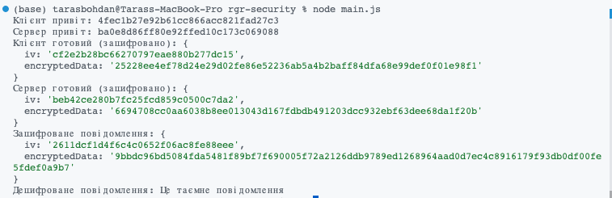

# Завдання на РГР. Курс Безпека ПЗ 2023.

## Базовий варіант. Реалізувати імітацію TLS \ SSL “рукостискання” (10 балів):

1. Ініціювання клієнтом:

- Клієнт ініціює рукостискання, надсилаючи повідомлення "привіт" (рандомно згенероване) на сервер.

2. Відповідь сервера:

- Сервер відповідає повідомленням "привіт сервера" (рандомно згенероване), що містить також SSL-сертифікат (.509). (Або для базового варіанту - сервер генерує public \ private ключі та відправляє public клієнту).

3. Автентифікація:

- Клієнт перевіряє SSL-сертифікат сервера в центрі сертифікації для підтвердження ідентичності сервера. (У випадку базового варіанту - пропустіть)

4. Обмін секретними рядками:

- Клієнт надсилає секрет premaster, який шифрується відкритим ключем
- Сервер розшифровує секрет premaster.

5. Генерація ключів сеансу:

- Клієнт і сервер генерують ключі сеансу з клієнтського та серверного випадкових рядків і секрету premaster.

6. Готовність клієнта та сервера:

- Клієнт та сервер надсилають повідомлення "готовий", зашифроване сеансовим ключем.

7. Завершення рукостискання:

- Здійснюється безпечне симетричне шифрування, і рукостискання завершується.
- Зв'язок продовжується за допомогою ключів сеансу.

Реалізувати передачу даних по захищеному каналу (наприклад, повідомлення чату, текстовий файл).

# How it works

